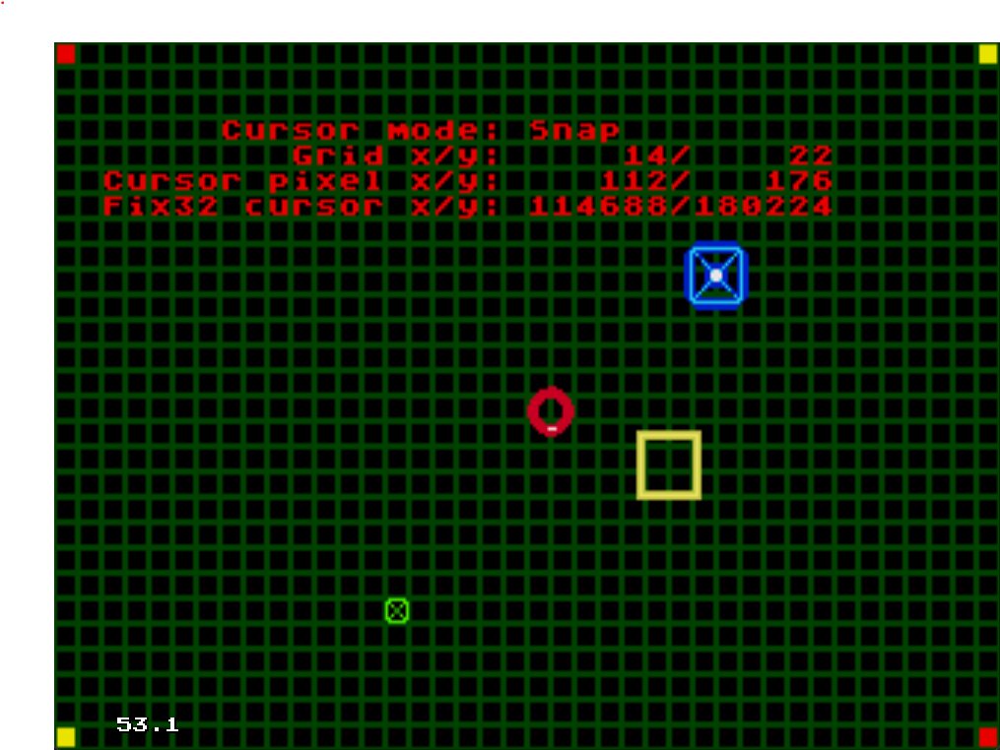

== Sega Megadrive/Genesis Cursor - Coordinates Demo
Cursor X/Y Tech Demo.

This project  was created to help me better understand sprite movement and screen coordinates as well as the perils of 
not converting fix32 numbers back to ints when required.

The code here is no way ideal, other than it works and I got the information and learning I needed.
Use at your own risk, risk of being awesome.

Features::
* Pressing the button [A] will swap switch modes between Snap and Free.
- Snap Mode: Snaps cursor to the background grid.
- Free Mode: Allows the cursor to free roam the screen.
* Debug text
- X/Y 8x8 pixel grid location (Top Left of cursor).
- X/Y Pixel on screen.
- X/Y Pixel location in fix32.
- Moves out of the way of the cursor.
* Other
- Random falling objects with random varying speeds and X locations.
- Asprite files.  (https://www.aseprite.org/) - Edit my pixels baby!

= Other
- Using  SGDK version 2.11 / https://github.com/Stephane-D/sgdk
- Based on learnings from watching Pigsy's Retro Game Dev Tutorials / https://www.youtube.com/@PigsysRetroGameDevTutorials
